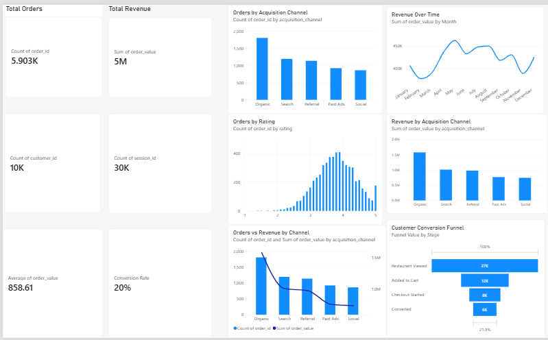
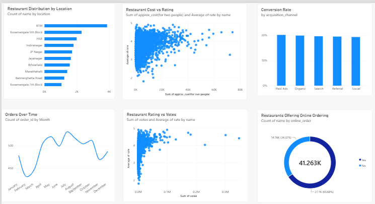

# Project Phoenix — Zomato Product Analytics

> An end-to-end product analytics project analyzing **41K+ records** using SQL, MySQL, Python and Power BI to evaluate customer conversion, acquisition performance, ordering behaviour and restaurant marketplace dynamics.

---

## 📊 Project at a Glance

| Metric | Result |
|---|---:|
| **Records Analyzed** | **41K+** |
| Restaurant Views | **27K** |
| Added to Cart | **12K** |
| Checkout Started | **8K** |
| Converted Orders | **6K** |
| View → Order Conversion | **~22%** |
| Highest Revenue Channel | **Organic** |
| Organic Revenue | **~₹1.55M** |
| Organic Orders | **~1.8K** |

*Dashboard values are rounded as displayed in Power BI.*

---

## 🎯 Business Objective

The objective of Project Phoenix is to understand the customer journey and identify the factors that influence conversion, revenue and repeat purchasing behaviour.

The analysis focuses on:

- Customer conversion and funnel drop-offs
- Acquisition channel performance
- Revenue and order contribution by channel
- One-time vs. repeat customer behaviour
- Restaurant marketplace distribution
- Restaurant pricing, ratings and popularity
- Online-order adoption

---

## 🔍 Key Findings

### 1. Customer Funnel

The customer journey moves through four major stages:

**27K Restaurant Views → 12K Carts → 8K Checkouts → 6K Conversions**

This represents approximately **22% conversion from restaurant views to completed orders**.

The largest volume drop occurs between **restaurant viewing and adding to cart**, making this an important stage for conversion optimization.

---

### 2. Acquisition Channels: Revenue vs. Volume

**Organic** was the strongest channel in terms of both order volume and revenue.

- ~**1.8K orders** from Organic
- ~**₹1.55M revenue** from Organic
- Search generated approximately **1.2K orders**
- Referral generated approximately **1.1K orders**
- Paid Ads and Social generated lower order volumes

This highlights the importance of comparing channels using **both revenue and order volume**, rather than relying on conversion rate alone.

---

### 3. Conversion Rate Is Relatively Consistent Across Channels

Conversion rates across the five acquisition channels were close to **20%**.

| Channel | Approx. Conversion |
|---|---:|
| Paid Ads | **~20%** |
| Organic | **~20%** |
| Search | **~20%** |
| Referral | **~19–20%** |
| Social | **~19%** |

The relatively small difference in conversion rates suggests that **channel scale and revenue contribution** are important when evaluating acquisition performance.

---

### 4. Organic Leads Revenue Performance

Organic contributed approximately **₹1.55M in order value**, making it the highest-revenue acquisition channel in the analysis.

Search and Referral each contributed approximately **₹1.0M**, while Paid Ads and Social contributed lower revenue.

This creates a useful business question:

> Should additional acquisition investment focus on increasing high-performing organic traffic, or improving the efficiency of lower-volume paid channels?

---

### 5. Order Activity Over Time

Monthly order volume remained relatively stable, generally ranging around **430–530 orders per month**.

Revenue also remained relatively consistent, with monthly revenue broadly around **₹0.38M–₹0.48M**.

This indicates a relatively stable ordering pattern rather than a single month driving the majority of business performance.

---

### 6. Restaurant Marketplace

The restaurant marketplace analysis examines:

- Restaurant distribution by location
- Restaurant type
- Cuisine
- Customer ratings
- Customer votes
- Approximate cost for two
- Online-order availability

**BTM** appears as the largest restaurant cluster among the locations shown, with approximately **3.8K listings**, followed by Koramangala 5th Block and HSR.

This highlights the concentration of restaurant supply across specific locations and provides a basis for location-level marketplace analysis.

---

## 📈 Power BI Dashboards

### Customer & Order Dashboard

The dashboard analyzes:

- Funnel performance
- Orders over time
- Revenue over time
- Acquisition channels
- Revenue by acquisition channel
- Orders by acquisition channel



---

### Restaurant Marketplace Dashboard

The dashboard analyzes:

- Restaurant distribution
- Location
- Restaurant type
- Ratings
- Popularity
- Pricing
- Online-order adoption



---

## 🧠 Business Questions Answered

### Customer & Conversion
1. How many users move from restaurant viewing to ordering?
2. Where is the biggest funnel drop-off?
3. What is the overall conversion rate?

### Acquisition
4. Which channel generates the most orders?
5. Which channel generates the most revenue?
6. How do conversion rates compare across channels?

### Customer Behaviour
7. How many customers place multiple orders?
8. How does repeat-customer behaviour differ from one-time customers?
9. What are the differences in order value, delivery time and ratings?

### Marketplace
10. Which locations have the highest restaurant concentration?
11. Which restaurant types dominate the marketplace?
12. How do restaurant ratings, popularity and pricing vary?
13. How widely is online ordering adopted?

---

## 🛠️ Tools & Technologies

- **MySQL** — Data management, Data validation, transformation, KPI calculation and analysis
- **Python** — Data exploration and supporting analysis
- **Power BI** — Data modeling, DAX, KPI visualization and dashboards
- **GitHub** — Documentation and project version control

---

## 🔄 Project Workflow

```text
Raw Data
   ↓
Data Cleaning & Validation
   ↓
MySQL Database
   ↓
SQL Analysis
   ↓
KPI & Business Analysis
   ↓
Power BI Data Model
   ↓
Interactive Dashboards
   ↓
Business Insights

---

## 👩‍💻 Author

### Sheetal Choudhary

**Data Analytics Portfolio Project**

**Skills:** SQL • MySQL • Python • Power BI • Data Cleaning • Data Analysis • Data Visualization • Business Analytics
